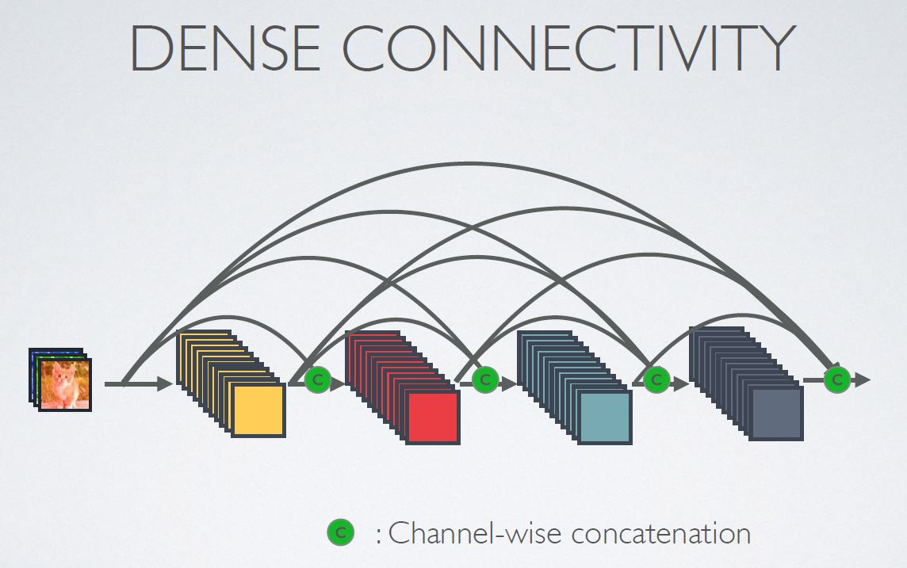
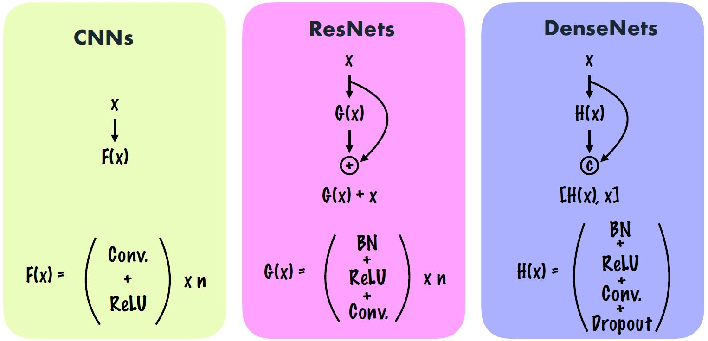

# DenseNet-of-CIFAR-10

## Densenet-Tensorflow
Keras implementation of [Densenet](https://arxiv.org/pdf/1608.06993v3.pdf) using **Cifar10**
* The code that implements *this paper* is present in **IPYNB**

If you want to see the ***original author's code*** or ***other implementations***, please refer to this [link](https://github.com/liuzhuang13/DenseNet)

## Requirements
* Tensorflow 1.x

### What is the "Dense Connectivity" ?

### What is the "Dense Block" ?

### What is the "Densenet Architecture" ?

## Compare Structure (CNN, ResNet, DenseNet)

## Implementation:
* Implemented **DenseNet-BC (k =12 ,L = 100) [0.76M parameters]**. 
* Network Trained on 70 Epochs.
* No Dropout was used
* Image Augmentation was used.

## Results:
I was able to achieve accuracy of **92.7%** by training for 70 Epochs.

### Loss And Accuracy Plots

### Confusion Matrix

